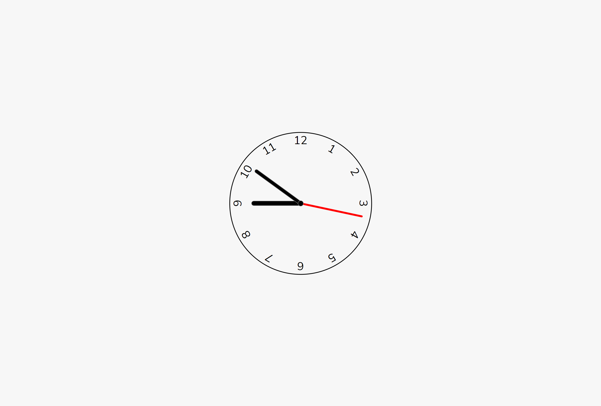

# Relógio analógico com Javascript

Desenvolvido para aprendizado. Realizado Relógio Analógico com JavaScript. 20/10/22

[🔗 Clique aqui para acessar] (https://michel-maia.github.io/Relogio-analogico-com-Javascript/)

## 💻 Tecnologias

- HTML
- CSS
- Javascript

## Referência

- [Youtube] https://www.youtube.com/c/WillDev2022

- [css-tricks] https://css-tricks.com/almanac/properties/t/text-align-last/

